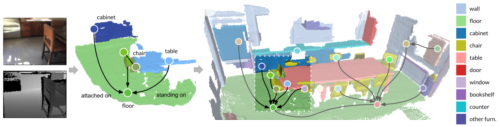

# SceneGraphFusion

**Authors**: [Shun-Cheng Wu][sc], [Johanna Wald][jojo], [Keisuke Tateno][keisu], [Nassir Navab][nassir] and [Federico Tombari][fede]

[sc]:http://campar.in.tum.de/Main/ShunChengWu
[keisu]:http://campar.in.tum.de/Main/KeisukeTateno
[jojo]:http://campar.in.tum.de/Main/JohannaWald
[nassir]:http://campar.in.tum.de/Main/NassirNavabCv
[fede]:http://campar.in.tum.de/Main/FedericoTombari

This is the SceneGraphFusion c++ framework. For the network part of the code, check [here](https://github.com/ShunChengWu/3DSSG).

# Prerequisites
## git, cmake
```
apt update
apt install git
# cmake
sudo apt install python3-pip
pip3 install cmake
# create ssh key and associate to your account in order to clone this project.
# * Generate new ssh key [link](https://docs.github.com/en/github/authenticating-to-github/generating-a-new-ssh-key-and-adding-it-to-the-ssh-agent)
# * Adding a new ssh key to your account [link](https://docs.github.com/en/github/authenticating-to-github/adding-a-new-ssh-key-to-your-github-account)
```
# OpenCV, Eigen
```
# Eigen3 3.3.90  
# OpenCV 4.0.0  
# This project will try to install them locally if they were not found.
```
# Assimp
loading meshes for online rendered view generation. 
```
apt install libassimp-dev
```

# Optional dependencies
With GUI:
```
# OpenGL & Glfw3
apt install freeglut3-dev libglfw3-dev

```
With graph prediction:
```
# Onnxruntime
# See https://github.com/microsoft/onnxruntime
git clone --recursive https://github.com/Microsoft/onnxruntime
cd onnxruntime
# For Linux
./build.sh --config RelWithDebInfo --build_shared_lib --parallel
```

#### BUILD
build the basic segmentation system 
```
git clone {this_repo}
cd SceneGraphFusion
git submodule init
git submodule update
mkdir build
cd build
cmake ..
make
```
build with GUI or graph prediction, pass these options in cmake:
```
cmake -DBUILD_GRAPHPRED=ON -DBUILD_GUI=ON ..
```
Note that the graph prediction module is not yet released. You may encounter error if you build with `BUILD_GRAPHPRED=ON`. That part will be released soon.

# Run
```
./exe_GraphSLAM --pth_in path/to/3RScan/squence/
# or with GUI
./exe_GraphSLAM_GUI --pth_in path/to/3RScan/squence/
# to see usage and options 
./exe_GraphSLAM --help
# to run with graph prediction (need to build with graph predict)
./exe_GraphSLAM_GUI --pth_in path/to/3RScan/squence/ --pth_model /path/to/the/traced/model/folder/
```

We provide data loader for 3RScan dataset and ScanNet. In default, we use rendered view for both dataset. The rendered view
will be generated during on time.

you can download the traced model of our pretrained network [here](https://drive.google.com/file/d/1_745ofaOUyP_iFK8A3cSW60L4V7TlWa7/view?usp=sharing)

[comment]: <> (For 3RScan you will need to generate rendered depths and aligned poses. See [3RScan]&#40;https://github.com/WaldJohannaU/3RScan/tree/master/c%2B%2B&#41;)
### Example:
To run our system with a test sequence, run `bash prepare_example_data.sh`. It will download an example sequence provided from
[3RScan](https://github.com/WaldJohannaU/3RScan) repository. Then run
```
cd bin
./exe_GraphSLAM --pth_in ../data/3RScan/4acaebcc-6c10-2a2a-858b-29c7e4fb410d/sequence/
```
Or using the full sequence from either ScanNet or 3RScan
```
# For 3RScan:
./exe_GraphSLAM --pth_in [path/to/3RScan]/[sequence_id]/sequence/
# For ScanNet
./exe_GraphSLAM --pth_in [path/to/scannet]/[scan_id]/[scan_id].sens
# Run with graph prediction
./exe_GraphSLAM --pth_in ./path/to/data --pth_model /path/to/model
```


# License
[](https://opensource.org/licenses/BSD-2-Clause)

### Paper
If you find the code useful please consider citing our [paper](https://arxiv.org/pdf/2103.14898.pdf):

```
@inproceedings{Wu2021,
    title = {{SceneGraphFusion: Incremental 3D Scene Graph Prediction from RGB-D Sequences}},
    author = {Shun-Cheng Wu and Johanna Wald and Keisuke Tateno and Nassir Navab and Federico Tombari},
    booktitle = {Proceedings IEEE Conference on Computer Vision and Pattern Recognition (CVPR)},
    year = {2021}
}
```
